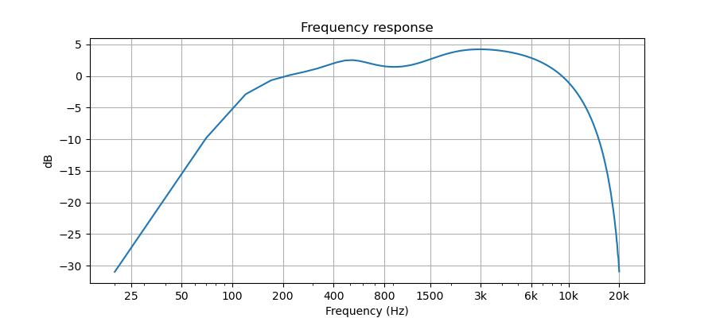

# logWMSE

This audio quality metric, logWMSE, tries to address a limitation of existing metrics:
The lack of support for digital silence. Existing audio quality metrics, like VISQOL,
CDPAM, SDR, SIR, SAR, ISR, STOI and SI-SDR are not well-behaved when the target is
digital silence.

# Installation

`pip install git+https://github.com/nomonosound/log-wmse-audio-quality`

# Usage example

```python
import numpy as np
from log_wmse_audio_quality import calculate_log_wmse

sample_rate = 44100
input_sound = np.random.uniform(low=-1.0, high=1.0, size=(sample_rate,)).astype(np.float32)
est_sound = input_sound * 0.1
target_sound = np.zeros((sample_rate,), dtype=np.float32)

log_wmse = calculate_log_wmse(input_sound, est_sound, target_sound, sample_rate)
print(log_wmse)  # Expected output: ~18.42
```

# Motivation and more info

Here are some examples of use cases where the target (reference) is pure digital silence:

* **Music source separation:** Imagine separating music into stems like "vocal", "drums",
 "bass", and "other". A song without bass would naturally have a silent target for the "bass" stem.
* **Speech denoising:** If you have a recording with only noise, and no speech, the target
 should be digital silence.
* **Multichannel speaker separation** When evaluating speaker separation in a windowed
 approach, periods when a speaker isn't speaking should be evaluated against silence.

Mean squared error (MSE) is well-defined for digital silence targets, but has several drawbacks:

* The values are commonly ridiculously small, like between 1e-8 and 1e-3, which makes number formatting and sight-reading hard
* It's not tailored specifically for audio
* Lack of scale-invariance
* Doesn't consider the frequency sensitivity of human hearing
* It's not invariant to tiny errors that don't matter (because humans can't hear those errors anyway)
* It's not logarithmic, like human hearing is

**logWMSE** attempts to solve all the problems mentioned above. It's essentially the **log**
of a frequency-**weighted MSE**, with a few bells and whistles.

The frequency weighting is like this:


This audio quality metric was made with **high sample rates** in mind, like 36000, 44100
and 48000 Hz. However, in theory it should also work for low sample rates, like 16000 Hz.
The metric function performs an internal resampling to 44100 Hz to make the frequency
weighting filter consistent across multiple input sample rates.

Unlike many audio quality metrics, logWMSE accepts a *triple* of audio inputs:

* unprocessed audio (e.g. a raw, noisy recording)
* processed audio (e.g. a denoised recording)
* target audio (e.g. a clean reference without noise)

Relative audio quality metrics usually only input the two latter. However, logWMSE
additionally needs the unprocessed audio, because it needs to be able to measure how
well input audio was attenuated to the given target when the target is digital silence
(all zeros). And it needs to do this in a "scale-invariant" way. The scale invariance in
logWMSE is not exactly like SI-SDR, where the processed audio can have arbitrary scaling
compared to the target and still get the same score. logWMSE requires the gain of the
target to be consistent with the gain of the unprocessed sound. And the processed sound
needs to be scaled similarly to the target for a good metric score. The scale invariance
in logWMSE can be explained like this: if all three sounds are gained by an arbitrary
amount (the same gain for all three), the metric score will stay the same. Internally,
that property is implemented like this: the processed audio and the target audio are
both gained by the factor that would be required to bring the filtered unprocessed audio
to 0 dB RMS.

logWMSE is scaled to the same order of magnitude as common SDR values. For example,
logWMSE=3 means poor quality, while logWMSE=30 means very good quality. In other words,
higher is better.

`calculate_log_wmse` accepts 1D or 2D numpy arrays as input. In the latter case,
the shape is expected to be `(channels, samples)`. The dtype of the numpy arrays is
expected to be float32.

Please note the following limitations:

* The metric isn't invariant to arbitrary scaling, polarity inversion, or offsets in the estimated audio *relative to the target*.
* Although it incorporates frequency filtering inspired by human auditory sensitivity, it doesn't fully model human auditory perception. For instance, it doesn't consider auditory masking.
